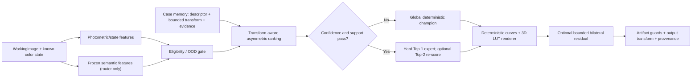
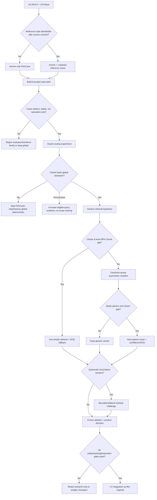

# FilmCase 自主无配对研究计划

> **角色：** `ULT/U5` 下的详细科研分支说明，不是第二个 active tracker。
> **执行状态 authority：** `docs/ULTIMATE_EXECUTION_TRACKER.md`。
> **产品标准：** 在冻结的严重伪影门槛下，最大化强烈、好看、可辨认的胶片风格。
> **研究边界：** 不要求用户提供照片、胶片/数码配对、逐图标签或进一步选择；不使用生成式图像模型；最终全分辨率 RGB 只由确定性受约束算子渲染。
> **声明边界：** 无配对结果只能支持 `film-inspired` / `unpaired-evidence`，不能支持“准确复现某款胶片”的 calibrated claim。
> **冻结日期：** 2026-07-11。

---

## 0. 一页结论

机器学习路线没有全军覆没，但过去的训练问题问错了：

- 旧 V1 把多个风格蒸馏到同一个 pseudo-teacher，并用共享 basis + L1 RGB 回归，最终所有风格几乎只选同一个 basis；
- 旧 V2 的 SepLUT/NILUT/Context4D 仍主要在复现 pseudo-teacher，不是在学习用户真正喜欢的跨场景调色规律；
- 旧 local-map gate 直接奖励色度增加，因此“只会加饱和度”也能拿到好分；
- 一个 dense regressor 面对多种都合理但差异显著的调色，会把模式平均成安全、寡淡的中间值。

本计划研究的不是“再训练一个输出图片的网络”，而是：

> **FilmCase = 场景检索 + 变换适用性排序 + 硬稀疏专家选择 + 确定性受约束渲染。**

对每张查询图，系统寻找“哪些历史 case 的调色变换在这张图上也安全且有效”，选择一个专家；默认不平均多个风格。一个 case 不是一张胶片扫描，也不是不存在的配对真值，而是：

```text
受约束、可重放的颜色变换
+ 适用场景/光照/曝光描述
+ 无配对风格证据与冻结偏好锚点关系
+ 伪影、稳定性、权利和谱系状态
```

第一关键门不是训练，而是 **identifiability**：现有 Flickr 胶片图的 scene、scanner、uploader、process 等混杂是否允许检测到稳定风格信号。第二关键门是 **Oracle routing**：如果已知每张图最合适的专家时仍不能明显胜过一个全局冠军，就停止 FilmCase，不再训练检索器。

---

## 1. 冻结研究契约

### 1.1 用户不再成为依赖

本分支必须自主完成：

- 现有资产、来源、权利、谱系和 split 审计；
- query/reference pool 构建；
- case 变换生成、筛选和去重；
- 视觉审阅、全分辨率 stress crop、严重伪影裁决；
- 训练、消融、失败分析和报告；
- 下一轮实验选择。

不得把以下事项写成 DoR：

- 用户提供胶片/数码配对；
- 用户逐图选 A/B；
- 用户补充喜欢或不喜欢的样本；
- 用户人工标注场景、肤色、天空或伪影。

仍需人工批准的只有既有治理门：许可证决定、付费/大规模下载、昂贵 GPU、外部联络、push/release 等。批准门不能被“自主完成”解释为已授权。

### 1.2 唯一冻结的用户偏好证据

用户给出的集合为 `53, 55, 56, 33, 09, 03, 02, 01`。保持原顺序但不把它解释为排名。

| 用法 | 方案 | 约束 |
|---|---|---|
| 全集正锚点 | `53/55/56/09/01` | 必须重渲染到同一冻结 query manifest 后才能公平比较 |
| 方向提示 | `33/03/02` | 仅 1–2 张 smoke，不作为晋级标签 |
| 安全桥 | `09` | 当前 union 指标零新增 clipping，但仍有红色高光 speckle 风险 |
| 风格桥 | `56` | 当前视觉目标是保留其 cool-shadow / warm-subject palette strength |
| 弱风格负对照 | safe-rich、旧 local maps | 技术稳定但视觉寡淡 |
| 不稳定负对照 | 旧 NILUT 强度变体、红光自行车失败 | 强变化不等于稳定的目标风格 |

这些锚点只能说明产品所有者的审美方向，不能证明 stock/process authenticity。

### 1.3 成功与失败

FilmCase 成功必须同时满足：

1. 所有输出由相同坐标的确定性曲线/LUT/可选 bounded grid 生成；
2. 冻结 gold set 上零个确认 severe artifact；
3. 对全局确定性冠军有稳定、跨 scene-group 的风格/吸引力增益；
4. 增益不是由统一增加饱和度、对比度或压暗造成；
5. 路由对无损编码、轻微 resize/crop 和重复运行稳定；
6. OOD/低置信度能回退到全局冠军；
7. 权利、谱系、配置、模型、case 和输出可重放；
8. 最简单通过门槛的候选获胜，允许结论为“无需 ML”。

立即失败或停线：

- identifiability gate 不能从 source/uploader/scanner/scene 混杂中分离稳定目标信号；
- Oracle 不能胜过全局冠军；
- 自动 evaluator 与重复视觉审阅方向不一致；
- 只有 mean chroma/contrast 增益，没有 palette identity；
- 任何候选在 gold set 出现确认 severe artifact；
- generic retrieval 已足够接近 Oracle，却继续增加模型复杂度；
- 训练或 reference 数据权利不足以支持预定发布 lane。

### 1.4 非目标

- 不训练 diffusion、GAN 图像生成器或直接 RGB image-to-image generator；
- 不从无配对 film scans 声称恢复物理 sensitometry 或准确 stock look；
- 不让语义网络改变物体、几何、纹理或最终像素；
- 不以一个综合分数覆盖安全、风格、路由和性能的冲突；
- 不把 film grain、halation、bloom 用来掩盖一个寡淡或有缺陷的 color model；
- 不在 U4、U0.3/U0.4 未冻结前启动大规模训练。

---

## 2. 当前证据与根因诊断

### 2.1 为什么旧 ML 产生平均色

| 证据 | 根因 | 对新方案的约束 |
|---|---|---|
| V1 六个 style 几乎全压到一个 basis | shared-basis soft routing + 单一 L1 目标允许模式坍塌 | 不用 dense RGB 回归作为核心；先证明专家模式真实存在 |
| V2 蒸馏 pseudo-teacher | 目标本身没有新的风格信息 | pseudo-target 只能用于工程回归，不能作为风格真值 |
| local maps 主要像饱和度 | gate 直接奖励 ≥3% chroma | 加入 saturation/contrast-matched 反事实 |
| NILUT 有较高 mean chroma 但风格不稳定 | aggregate color movement 不编码 palette coherence | 分曝光、分语义区域、分 scene 报告 |
| #09 零 clipping 仍有红色 speckle | clipping 不是视觉伪影的充分条件 | 加局部高色度岛、chroma/luma edge mismatch 和全分辨率裁决 |

### 2.2 目标风格的可检验签名

由现有视觉审计得到的工作假设：

- cyan/blue 阴影与 red/orange/yellow 主体或高光形成分离；
- 中到强的亮度重塑是风格的一部分；
- hue-specific palette 比统一 chroma 增益重要；
- 暖红/橙应保持明亮，不能普遍变成暗酒红；
- 天空可略偏 cyan，但云和高光保留层次；
- 中性墙、雪和肤色不能被 blanket cast 污染；
- 几何、文字和纹理保持输入原生结构。

这些签名在 U5.FC1 中冻结为可测 descriptor，不在看完 test 结果后改写。

### 2.3 为什么“相似照片 → 相似调色”值得研究

研究先验支持但不证明本项目会成功：

- Context-Based Automatic Local Image Enhancement 先检索候选图，再在相似上下文中寻找变换，说明 context-conditioned retrieval 可以优于单一全局增强；
- InstantRetouch 使用 content-similar reference pair 的 retrieval-augmented retouching，直接支持“相似案例影响当前调色”，但它依赖 paired examples，不能解决本项目的 case 构造；
- 2026 unpaired ISP 工作用 DINOv2、颜色/风格统计和 optimal transport 构造 semantic pseudo-pairs；其 random pairing 输出更 pale，高光更易失真，说明伪配对质量可能比模型大小更重要；
- 同一 unpaired ISP 工作还发现普通 patch kNN 会 many-to-one collapse，较有表达力的 3D LUT 在噪声伪标签下出现色偏，而受限线性颜色头更稳，支持本计划的“先匹配、后小模型、再逐步增加变换表达力”；
- Neural Preset 说明没有 pair 时仍可学习 deterministic color mapping，但并不证明 stock authenticity；
- SepLUT、HDRNet、SA-LUT 和 RSFNet 支持把最终渲染限制为可解释的全局或局部颜色参数，而不是生成图像。

---

## 3. 可证伪假设

| ID | 假设 | 最小判别实验 | 否证后的动作 |
|---|---|---|---|
| H-ID | 权利/谱系合格的 unpaired reference 中存在超越 scene/uploader/scanner 的稳定风格信号 | source-confound-controlled classification/retrieval | 停止 reference-derived case；只保留 owner-anchor lane |
| H0 | 一个全局确定性方案已与 per-scene 最优一样好 | Global champion vs Oracle | H0 不被拒绝则停止 FilmCase |
| H1 | 不同 scene state 的安全最优变换存在稳定异质性 | 重复渲染、benign perturbation、group holdout | 不稳定则修 evaluator/case family 或停止 |
| H2 | generic visual similarity 足以预测变换适用性 | handcrafted/DINO kNN vs Oracle | 若足够，直接用简单 kNN，不训练 reranker |
| H3 | transform-aware asymmetric ranking 优于 generic similarity | cross-application utility ranker | 无增益则保留 generic baseline |
| H4 | hard Top-1/medoid routing 比 soft averaging 更能保留风格模式 | hard vs soft/dense matched-compute ablation | hard 无优势则保留更简单且稳定者 |
| H5 | `global style + bounded case residual` 比每 case 独立 full transform 更稳 | matched-capacity ablation | 独立专家若不稳定则禁止 |
| H6 | local residual 只在明确局部失败类上提供独立价值 | global winner vs bounded bilateral grid | 无独立增益或有 halo/speckle 就删除 local branch |
| H7 | confidence/OOD fallback 能把路由失败限制为全局方案风险 | held-out domain + synthetic OOD | 不能可靠回退则不产品化 |
| H-EVAL | 自主 evaluator 与冻结锚点、重复视觉审阅方向一致 | blind shuffled replay + counterfactual controls | evaluator 不一致时禁止模型晋级，先修 U4 |

---

## 4. FilmCase 架构



### 4.1 特征分支

第一版先用不需下载的 hand-crafted features：

- log-luma quantiles、dynamic range、shadow/highlight fraction；
- neutral/skin/sky/foliage/red-object 等区域占比及置信度；
- Lab/JzAzBz hue-chroma histograms，按曝光分箱；
- illuminant/WB proxy、channel ratios、clipping headroom；
- local contrast、gradient smoothness、noise/speckle risk；
- input color state、camera/source domain、decode path。

只有 generic baseline 不能关闭 Oracle gap 时，才加入 frozen DINOv2/SigLIP 等语义 embedding。语义特征只做检索/路由，不参与全分辨率像素生成；缺失权重如需大下载仍走批准门。

### 4.2 变换表示

变换容量按以下阶梯逐级开放；每一级只有扩大 style–artifact Pareto frontier 才进入下一级：

1. 3×3 color correction matrix + 单调 log-luma / per-channel spline curves；
2. 平滑、gamut-safe 的独立 17³ 3D LUT residual；
3. SepLUT：1D tone 与 3D color residual 分离；
4. 多个离散 `global + bounded residual` 专家；
5. highlight roll-off、source-chroma compression 和有限 neutral/skin protection；
6. 固定坐标、tetrahedral interpolation、无 spatial resampling；
7. 可选 local branch 只允许低分辨率 bilateral-grid affine residual，并有幅度、TV、halo 和 tile 约束。

2026 unpaired ISP 的直接消融表明，噪声 pseudo-pair 下更有表达力的 3D LUT 可能出现稳定色偏，而受限线性颜色头更稳。因此 17³ LUT 是 challenger，不是未经比较的默认胜者。

参数关系为：

```text
θ_case = compose(θ_style_global, bounded Δθ_case)
output = deterministic_render(input, θ_case)
```

case 聚类使用 **medoid transform**，不对明显不同的 LUT 做均值。这样减少专家数量时仍保留真实模式。

### 4.3 CaseRecord 最小 schema

```yaml
case_id: stable-id
style_id: owner-velvia-inspired-v1
source_hash: sha256
source_group: camera/uploader/scene-group
input_color_state: scene|display|unknown
feature_version: filmcase-feature-v1
references:
  - id: research-reference-id
    source_group: uploader/roll/scan-group
    rights: research-only|production-cleared
    allowed_use: research|internal-product|release
effective_allowed_use: strict-intersection-of-all-references
global_profile_hash: sha256
transform_hash: sha256
transform_family: curve-plus-lut-v1
residual_bounds: {...}
evidence_vector:
  severe_artifact: pass|fail|ambiguous
  style_salience: ...
  anchor_match: ...
  stability: ...
  applicability_support: ...
ood_support: {...}
case_split: train|validation
case_memory_eligible: true
lineage: {...}
```

`gold`、`stress` 和 final test 只评估 case，永远不能成为 active case memory 或产生 router 监督。多个 reference 的权利逐条保存，case 的 `effective_allowed_use` 取所有输入、reference 和派生资产 allowed-use 的最严格交集；任何一个 research-only reference 都会使整个 case 保持 research-only。

### 4.4 Case 如何在无配对条件下产生

采用两条独立 lane，禁止静默混合：

**Anchor lane**

1. 在同一 query manifest 上重放 `53/55/56/09/01`；
2. 围绕 #09 containment 和 #56 palette strength 生成受约束候选；
3. 每张 query 只保留 artifact-safe、非寡淡、通过反事实控制的候选；
4. 形成“输入状态 → 安全有效变换”的 case。

**Unpaired reference lane**

1. 先按权利、stock/process/scan metadata 和 source group 清理 film reference；
2. 使用灰度/语义/曝光特征做 content matching，避免直接用目标颜色决定“内容相似”；
3. 对 top-K reference cluster 求 style descriptor medoid/barycenter，而不是把一张 scan 当真值；
4. 在受约束 transform family 内优化 query，使其接近分曝光、分区域的 reference style descriptors；
5. 任何需要大幅异常 LUT、产生 artifact、对 reference 选择敏感或不稳定的结果不进入 case memory；
6. 该 lane 永远只提供 unpaired film-style evidence。

两个 lane 的共同候选可以提高置信度；冲突时不平均，标记 ambiguous 并从 router 监督中排除。

---

## 5. 数据、权利与 identifiability

### 5.1 数据 lane

| Lane | 当前用途 | 能证明什么 | 不能证明什么 |
|---|---|---|---|
| A：现有 union40 + 冻结 preferred outputs | anchor/evaluator/初始 case | 所有者已表达的风格方向 | stock authenticity |
| B：FiveK freeze_v1 的 128 个 RAW-default inputs | digital query diversity，仅研究 | scene/lighting 泛化 | film truth；不得用 Expert C 当 film target |
| C：现有 Flickr/film reference | research-only style distribution | 无配对参考域的可识别性 | 可发布权重或准确 stock 映射 |
| D：未来 production-cleared unpaired assets | 可发布 FilmCase 候选 | `film-inspired` 训练证据 | calibrated stock truth |
| E：paired capture | 长期可选、deferred | 满足严格设计时可支持 calibrated claim | 不是本计划依赖 |

现有 Velvia Flickr 约 384 张，但当前 lineage 主要只到 `unknown-flickr-user-content`，且缺少可靠 uploader/roll/scanner grouping。数量不能替代 identifiability；U0.3 必须先修这一点。

### 5.2 Identifiability gate

在生成 reference-derived case 前：

1. 建立 source URL/ID、uploader、可能的 roll/lab/scanner、content hash、perceptual hash；
2. 以 source/uploader/scene group 做 split，禁止随机图片 split；
3. 训练只使用 style-insensitive content features 的 scene/source baseline；
4. 测试 stock/style descriptor 在控制 scene/source 后是否仍可复现；
5. 做 label permutation、source-only、scene-only、scanner-proxy-only 负对照；
6. 报告 leave-uploader/source-domain-out 结果和置信区间；
7. 如果 style signal 在严格 split 中消失，reference lane 终止，不通过增加网络容量挽救。

### 5.3 自主证据层级

| 优先级 | 证据 | 决策角色 |
|---:|---|---|
| 0 | 权利、谱系、split、严重伪影、确定性 | 硬门槛 |
| 1 | 冻结用户正锚点及视觉审计 | 产品方向先验 |
| 2 | 独立 artifact/style descriptors 与反事实 | 自动筛选 |
| 3 | unpaired film-reference cluster | 仅风格相似证据 |
| 4 | 重复、盲化、随机编号的 Codex 视觉裁决 | 视觉晋级证据；不伪装成人群研究 |
| 5 | 通用 aesthetics/style 模型 | 只做 tie-breaker，不能覆盖 0–4 |

模糊样本不强行 pseudo-label。每轮 evaluator 固定版本；test/gold 不能反向参与 case 生成或阈值调节。

---

## 6. 评测与预注册门槛

### 6.1 字典序决策，不用总分

顺序固定：

1. rights/lineage/experiment validity；
2. severe artifact veto；
3. 最低 style salience；
4. routing value / appeal proxy；
5. stability、OOD、性能和复杂度。

后面的高分不能补偿前面的失败。

### 6.2 四张 FilmCase 成绩单

**A. Severe artifact**

- 相同尺寸、无 warp/resample、确定性；
- clipping、gamut excursion、局部 hue discontinuity；
- high-chroma highlight speckling、colored islands、false neon edges；
- gradient banding/posterization、wall/sky blotch；
- skin/neutral contamination、text/edge corruption；
- tile seam、跨后端差异；
- gold 为零确认 severe；stress 按 scene/source group 报告发生率和 cluster-bootstrap 95% CI。

**B. Style salience**

- blind source vs bland vs #09 vs #56 vs candidate；
- cool-shadow/warm-subject separation；
- exposure-conditioned hue/chroma/tone signature；
- scene-to-scene palette coherence；
- saturation-matched、contrast-matched、luma-matched 反事实后仍可识别；
- color-only 与 full-look 分开，先冻结 color winner。

**C. Routing**

- Oracle–global gap；
- selected-vs-Oracle regret，按每项 scorecard 分开；
- hard Top-1/Top-2 hit、case support、expert utilization；
- benign perturbation route stability；
- leave-scene/source/camera/domain-out；
- global fallback frequency、OOD detection 和 fallback safety。

**D. Product**

- cold/warm latency、RAM/VRAM、24MP/100MP；
- CPU、RTX 12GB Laptop、M5 parity；
- replay recipe、case/model/profile hash；
- batch/tile determinism；
- 失败恢复和低置信度可解释性。

#### Primary routing endpoint 与 Oracle-gap 定义

“关闭 Oracle gap”只用于一个预注册的字典序 pairwise endpoint，不把四张成绩单加权成总分。对每个 held-out scene group，将三次 shuffle/crop 审阅先 adjudicate 成一个独立的 `win/tie/loss`：

1. 任一确认 severe failure 直接记 loss/ineligible；
2. 未达到冻结最低 style salience 的候选记 loss；
3. 对其余候选，比较 candidate 与 global champion 的 overall appeal；相同记 tie；
4. 一个 scene group 无论有多少 crop、重复审阅或相近帧，都只贡献一个 adjudicated outcome。

对方法 `m` 定义 win-equivalent rate：

```text
p_m = (scene-group wins + 0.5 × ties) / valid held-out query groups
G_oracle = p_oracle - 0.5
G_m = p_m - 0.5
oracle_gap_closure(m) = clip(G_m / G_oracle, 0, 1)
```

只有 `G_oracle > 0` 且 Oracle gate 显著成立时才计算 gap closure。置信区间以 **scene-group cluster bootstrap** 计算；零假设用 group-level sign/permutation test。三次 shuffle 只测 intra-rater consistency，不增加统计样本量。artifact、style descriptors、OOD 和性能仍分别报告，不能用这个 endpoint 补偿它们的失败。

### 6.3 初始数值门槛

这些是 FC1 的预注册默认值；可在只看 development pilot 时修订一次，之后对 validation/gold 冻结：

- gold set：`0` 个确认 severe artifact；
- Oracle 的 held-out scene-group `p_oracle` 必须至少为 `0.60`，cluster-bootstrap 95% 下界高于 `0.50`，且 group-level permutation/sign test 拒绝无增益；
- Oracle style salience 中位数至少提高 `0.5/5`，且至少两个非同源 descriptor family 的 bootstrap CI 不跨零；
- 至少两个 transform mode 各在 `≥10%` held-out groups 获胜，或一个较小 mode 明确解决预注册的高价值失败类；
- generic retrieval 若在上述 primary endpoint 的 point estimate 关闭 `≥80%` Oracle gap，且 `p_m` 的 scene-group bootstrap 95% 下界高于 `0.50`，则停止训练 learned reranker；阈值附近证据不足则标 `inconclusive`；
- learned reranker 只有在同一 endpoint 关闭 `≥80%` Oracle gap、且 group-level paired bootstrap 显著优于最佳 generic baseline 才晋级；
- route 在 lossless re-encode/metadata-only change 上 `≥99%` 一致，在轻微 resize/crop/exposure-preserving perturbation 上 `≥90%` 一致；
- 所有 `unknown` color state 和明确 unsupported HDR 必须 `100%` fail closed；
- 预定义高风险 OOD 的漏回退率目标 `≤5%`，in-domain 不必要回退率目标 `≤20%`；
- hard routing 相对 soft averaging 的 scene-group pairwise win-equivalent rate 需 `>0.55` 且 paired-bootstrap CI 支持正增益，或在相同风格下显著降低 artifact；否则选更简单者。

如样本量不足以支持 CI，结果标 `inconclusive`，不能按点估计晋级。

### 6.4 自主视觉协议

每次晋级比较：

1. 随机化候选编号与列顺序；
2. 保存 source、全图、1:1 stress crops 和差分诊断；
3. 用三个独立 shuffle/crop 顺序重复审阅；每轮都先 severe、再 style、最后 appeal；
4. 每次 pass 不显示方案名称和自动分数；
5. severe 获得 `2/3` 阳性即 veto；`1/3` 进入原分辨率 adjudication；
6. adjudication 后仍不一致的样本标 `AMBIGUOUS`，不得支持晋级；
7. 记录原始 votes、一致率和每个 failure category，不只保存赢家；
8. 报告所有 scene group，不删除不利图片；
9. 明确写成“自主视觉研究证据”，不冒充外部人类偏好研究。

---

## 7. DRPT 子树与叶任务

```text
U5.FC0  自主研究/声明契约
  └─ U5.FC1  lineage + identifiability + evaluator/anchor freeze
       └─ U5.1  global CCM/curves/LUT frontier
            └─ U5.FC2  bounded transform 与 CaseRecord/case bank
                 └─ U5.FC3  Oracle routing value
                      ├─ fail → 保留 global deterministic champion，停止 FilmCase
                      └─ pass → U5.FC4 generic retrieval baselines
                                   ├─ closes gap → 选择最简单 baseline
                                   └─ gap remains → U5.FC5 transform-aware ranker
                                                       └─ U5.FC6 hard sparse router + OOD
                                                            └─ U5.FC7 optional local residual
                                                                 └─ U5.FC8 frozen ablation/promotion
```

### U5.FC0 — 自主研究与声明契约

- **状态：** complete when this plan, tracker propagation and scoped commit exist。
- **DoR：** 用户约束、现有证据、authority map 已知。
- **输出：** 本计划；tracker/roadmap/board/agent-log 对齐。
- **DoD：** 不再把用户数据、用户标签或 paired pilot 写成主线依赖；无配对声明边界明确。
- **停止/回滚：** 文档冲突未消除则不进入 FC1；回滚本提交即可。
- **提交点：** 单独 documentation commit。

### U5.FC1 — Lineage、identifiability、anchor/evaluator freeze

- **依赖：** U0.3、U0.4；与 U4.1/U4.2 联合。
- **动作：**
  - 审计 union40、FiveK query、film references 的来源和 split；
  - 统一重放 `53/55/56/09/01`；
  - 冻结 severe rubric、style signature、full-resolution crops；
  - 运行 source-confound-controlled identifiability test；
  - 预注册 FC2–FC8 thresholds。
- **输出：** manifest v2、eligibility report、identifiability report、benchmark registry、blind sheet generator spec。
- **DoD：** 零 unresolved cross-split near duplicate；所有样本有 allowed-use；identifiability 为 strong-pass/weak-pass/fail/ambiguous/invalid；evaluator counterfactual checks 通过。
- **分支：**
  - strong-pass：style signal 超过 label-permutation 99th percentile，强于 grayscale/source controls，且至少三个 reference style clusters 能跨 source-group bootstrap 重现 → 允许多 case reference lane；
  - weak-pass：只有全局 style signal 稳定、多模态不稳定 → 只允许一个 unpaired global prior，不允许 reference-derived routing；
  - fail：控制 source/scene 后 signal 消失 → 只用 Anchor lane；
  - ambiguous：group metadata 不足 → 只修 lineage，不训练；
  - invalid：跨 split 泄漏或 evaluator control 失败 → 所有下游结果作废；
  - evaluator fail → 回 U4，禁止 case 生成；
  - rights fail → 保留 research-only，不进入产品 lane。
- **提交点：** schema/manifest 与 evaluator freeze 分成两个可回滚 commit。

### U5.FC2 — Bounded transform 与 case bank

- **依赖：** FC1，U5.1 已在 U2.2/U2.3 上冻结可重放 global champion。
- **动作：**
  - 消费并锁定 U5.1 global champion，禁止在 case evaluation 后反向重调；
  - 对 anchor neighbourhood 做 progressive candidate search；
  - 构建 anchor lane 和通过 identifiability 的 unpaired lane；
  - 应用 hard artifact filter、稳定性 filter、case 去重；
  - 以 medoid 保留变换模式。
- **输出：** CaseRecord schema、case manifest、transform files、cross-application matrix 初版、case gallery。
- **DoD：** 每个 case 可 hash/replay；无 case 来自 gold/test；无 ambiguous pseudo-label；full transform 与 global+residual 都有 baseline。
- **分支：**
  - 只有饱和度/对比度差异 → 修目标与 candidate family；
  - 高表达 LUT 不稳定 → 降为 curves/小 LUT/强 regularization；
  - case 数过少 → 进入 FC3 仍可测试，但不训练网络。
- **提交点：** schema/renderer adapter、case builder、case evidence 分开提交。

### U5.FC3 — Oracle routing value

- **依赖：** FC2 + frozen U4。
- **动作：** 在 validation/held-out scene groups 上，为每张图离线选择所有安全专家中的最佳者，并与 global champion 比较。
- **输出：** Oracle matrix、per-group win/loss、mode utilization、confidence interval、failure gallery。
- **DoD：** 所有候选相同 input/output/evaluator；无 test peeking；Oracle gate 有明确 pass/fail/inconclusive。
- **硬停止：**
  - fail → FilmCase 研究结束，U5 回到 global LUT/SepLUT challenge；
  - inconclusive → 扩充现有权利合格 query 或减少假设，不训练 router；
  - pass → 才能进入 FC4。
- **提交点：** 一个只包含 Oracle evaluator/report 的 commit；不提交 checkpoint。

### U5.FC4 — 非学习检索基线

- **依赖：** FC3 pass。
- **候选：**
  - global champion；
  - 手写 scene-state rule；
  - photometric kNN；
  - grayscale/semantic kNN；
  - k-medoids expert lookup；
  - random and source-only negative controls；
  - dense shared-LUT regressor 作为 averaging-collapse 对照；
  - OT/soft assignment 只用于 case matching，不用于最终颜色平均。
- **输出：** matched-compute benchmark、Oracle-gap closure、route stability。
- **DoD：** 最佳简单 baseline 确定；训练数据和评估 group 完全分开。
- **分支：** 若简单方法关闭 ≥80% gap，直接进入 FC6 的 confidence/fallback productization，跳过 FC5。
- **提交点：** features/retrieval implementation + report。

### U5.FC5 — Transform-aware asymmetric reranker

- **依赖：** FC4 仍有可解释 Oracle gap。
- **核心监督：** 不是 RGB target，而是将每个 case transform 交叉应用到 query 后得到的 applicability ordering。
- **效用：**

```text
U(query, case) =
  valid_rights_and_state
  → no_severe_artifact
  → style_salience
  → anchor/reference match
  → stability and complexity
```

- **模型：** 小型 asymmetric scorer `g(query_features, case_features, transform_features)`；使用 pairwise/listwise ranking 和置信度校准。
- **正负样本：** 同一 query 的安全 top cases 为正；bland、wrong-palette、artifact、OOD cases 为硬负。
- **输出：** ranker checkpoint/card、calibration curve、regret report、feature attribution。
- **DoD：** 关闭 ≥80% Oracle gap；优于 generic baseline；无 source/uploader shortcut；单卡 12GB 远低于上限。
- **分支：** 无显著增益 → 删除 ranker，保留 FC4 winner。
- **提交点：** model/data config、checkpoint manifest、evaluation report 分开提交；权重能否提交由 rights gate 决定。

### U5.FC6 — Hard sparse router、anti-collapse 与 OOD

- **依赖：** FC4 或 FC5 winner。
- **路由：**
  - 默认 hard Top-1；
  - Top-2 仅允许低分辨率再评分后硬选择，不默认加权平均 LUT；
  - margin/confidence 不足直接 global fallback；
  - case prototype 用 medoid；
  - 不用 load-balancing 强迫不存在的模式。
- **anti-collapse 诊断：**
  - expert utilization、routing entropy、per-mode support；
  - style-identifiability under saturation/contrast matching；
  - hard vs soft/dense ablation；
  - expert transform pairwise distance 与实际 utility；
  - collapse 若来自数据则停止，不用 diversity loss 伪造风格。
- **输出：** router、OOD thresholds、fallback recipe、explanation record。
- **DoD：** route stability/OOD gates 通过；任何路由错误仍受 renderer bounds 限制；输出记录 case/confidence/fallback reason。
- **提交点：** router + OOD tests；随后独立报告 commit。

### U5.FC7 — 可选 bounded local residual

- **依赖：** FC6 后仍有预注册的局部系统误差。
- **进入条件：** 错误必须集中在 skin/sky/highlight/neutral 等区域，且 global transform 无法同时修复；不能因为“局部模型理论更强”而进入。
- **候选：** HDRNet-style coarse bilateral grid；最后才考虑 bounded semantic masks。
- **限制：** low-resolution predictor、local affine coefficients、amplitude bound、TV、halo/tile tests；无 texture synthesis。
- **DoD：** 对目标失败类有独立增益；全部 gold 仍零 severe；100MP tile 一致。
- **分支：** halo、seam、speckle、风格不增或 runtime 不值 → 删除 local branch。
- **提交点：** local challenger implementation 与 promotion decision 分开。

### U5.FC8 — 冻结消融与晋级决策

- **依赖：** FC6；FC7 可选。
- **强制消融：**
  - anchor-only vs +unpaired reference；
  - handcrafted vs semantic features；
  - generic vs transform-aware；
  - hard vs soft/dense；
  - full expert vs global+residual；
  - global vs local；
  - confidence fallback on/off；
  - 17³ vs更小/更大 LUT；
  - saturation/contrast/luma-matched controls。
- **输出：** model/case/data cards、完整 raw metrics、failure gallery、cross-platform report、claim label。
- **晋级：** 最简单通过全部门槛者；可以是 global deterministic、kNN、small ranker 或 bounded local。
- **停止：** 任何 severe、权利、复现或 OOD 失败均不产品化。
- **提交点：** 最终 evidence-only decision commit；生产集成另开 U7 leaf。

---

## 8. 实验队列

| ID | 唯一改变变量 | 固定 baseline | 通过条件 | 失败动作 |
|---|---|---|---|---|
| EXP-FC-00 | lineage/identifiability | 当前 Flickr random split | 控 source 后仍有稳定 signal | 关闭 reference lane |
| EXP-FC-01 | normalized case diversity | #09/#56/global champion | 存在稳定、非 saturation-only 的多模式 | 保留 global |
| EXP-FC-02 | Oracle routing | global champion | 达到 §6.3 Oracle gate | 停止 FilmCase |
| EXP-FC-03 | retrieval feature | random/source-only controls | simple baseline 关闭 Oracle gap | 选最简单方法 |
| EXP-FC-04 | transform-aware applicability | best generic retrieval | ≥80% gap closure + no shortcut | 回退 generic |
| EXP-FC-05 | hard vs soft routing | matched experts/compute | hard 保留 style 且不增 artifact | 选实证 winner |
| EXP-FC-06 | OOD/fallback | router without fallback | 风险 OOD 正确回退 | 不产品化 router |
| EXP-FC-07 | local residual | global FilmCase winner | 只修系统局部失败且零 severe | 删除 local |
| EXP-FC-08 | full ablation | simplest champion | 所有增量都有独立价值 | 移除无贡献模块 |

每个实验固定输出：

- contract/config；
- code commit、env、device、seed；
- input/case/reference/evaluator manifest hashes；
- raw per-image/per-case metrics；
- blind full/crop gallery；
- CI、invalid/ambiguous count；
- decision、stop branch、下一叶；
- 一个 scoped local commit。

---

## 9. 条件研究树



---

## 10. 训练与优化细节

### 10.1 Case cross-application matrix

对 training/validation query `q_i` 和 case transform `θ_j`：

```text
y_ij = render(q_i, θ_global ∘ Δθ_j)
C_ij = {
  artifact_vector(y_ij),
  style_vector(y_ij),
  anchor/reference_distance(y_ij),
  stability_vector(y_ij)
}
```

不把 `C_ij` 压成一个可掩盖 safety 的标量。先按字典序产生 applicability rank，再训练 reranker 预测 rank。这个矩阵同时给出：

- Oracle upper bound；
- hard positives/negatives；
- asymmetric evidence：`θ_j` 适合 `q_i` 不意味着 `θ_i` 适合 `q_j`；
- expert redundancy 与 medoid selection；
- artifact-prone case 的淘汰证据。

### 10.2 防止平均化

- 目标是 ranking/selection，不是所有合理 target 的像素均值；
- hard Top-1 是默认，soft mix 是对照；
- global style 保存共同 palette，case residual 只负责 scene-specific deviation；
- style modes 由 Oracle utility 支持后才保留，不用均衡 loss 强行制造；
- 对 mean saturation、contrast、luma 做 matched control；
- 每个 expert 报告独立 transform、支持 scene groups 和失败条件；
- 如果一个 expert 覆盖全部 scene 且与 global 等价，承认 H0，不宣称 sparse experts 成功。

### 10.3 防止 shortcut

- source/uploader/camera/filename 不能作为可泛化 style 标签；
- group split 后做 source-only baseline；
- semantic embedding 与 photometric features 分开消融；
- query/reference 内容检索优先灰度/语义，不把目标色彩泄漏成“内容相似”；
- evaluator 与训练 feature 不共用唯一 backbone；
- test/gold 不产生 pseudo-label；
- 将 preferred anchors 随机编号，避免 scheme ID shortcut。

### 10.4 优化预算

采用 successive halving：

1. 低分辨率/小 query development sweep；
2. 淘汰明显 bland/artifact candidates；
3. survivor 做 full-resolution stress；
4. 最后才扩大 query groups 和训练 small ranker。

初始工程范围：

- 5 个 full anchors；
- union40 + FiveK freeze_v1 query diversity；
- 每个 anchor neighbourhood 先不超过 32–64 个 candidate transforms；
- 先跑 CCM + monotone curves；17³ LUT 和 SepLUT 逐级挑战；
- router/ranker 优先 MLP 或 tiny encoder，目标 <10M parameters；
- 全部能在 12GB Laptop GPU 或 CPU 上完成；不为 FC0–FC4 启动云 GPU。

这些是预算上限，不是统计充分性声明。

---

## 11. 伪影防线与回退

### 11.1 变换级约束

- monotone curve；
- LUT smoothness/Laplacian；
- bounded residual norm；
- gamut compression 与 highlight roll-off；
- 局部 Jacobian/hue discontinuity 检查；
- saturated-source chroma ceiling；
- neutral/skin protection 只在 demonstrated failure regions 启用；
- optional dither 只处理已确认的 quantization，不掩盖错误 LUT。

### 11.2 输入级 OOD

硬回退条件：

- color state `unknown` 且 profile 要求 scene-referred；
- unsupported HDR/gain-map；
- embedding support 低；
- top-1/top-2 margin 低；
- photometric range 超过 case bank；
- noise/highlight risk 超过训练 support；
- case/reference/model hash 不匹配；
- local predictor 失败或 tile parity 不通过。

回退输出仍可为强风格 global champion，但 metadata 必须记录 `fallback_reason`；不得静默伪装为 adaptive success。

### 11.3 两级安全

1. router 只选择已通过 case-level 安全筛选的 transform；
2. renderer 对每个新输入再次执行 runtime guards。

因此即使检索错误，最坏情况也被限制在受约束颜色变换内，而不是内容生成/几何改写。

---

## 12. 复现、文件与证据布局

未来实现沿用现有结构：

```text
configs/training/filmcase_*.yaml
configs/model/filmcase_*.yaml
scripts/build_filmcase_*.py
scripts/evaluate_filmcase_*.py
src/models/filmcase/
tests/test_filmcase_*.py
docs/FILMCASE_*_RESULTS.md
outputs/filmcase/<experiment-id>/   # ignored generated artifacts
```

不要新增顶层目录，不移动现有 flat scripts。每个 run 保存：

- manifest/split/evaluator/case hashes；
- config、seed、commit、env lock、device；
- model/profile/transform versions；
- raw metrics 和 failure gallery；
- route explanation；
- exact command；
- rights/allowed-use state。

任何 production promotion 需要独立 data/model/case/profile card。research-only 数据训练出的权重不能因指标好而自动转成可发布资产。

---

## 13. 风险登记

| 风险 | 早期信号 | 缓解 | 停止条件 |
|---|---|---|---|
| stock signal 实为 uploader/scanner/scene | random split 高、group split 崩溃 | identifiability + leave-source-out | 严格 split 无 signal |
| pseudo-pair 噪声导致寡淡 | random matching pale、highlights saturate | coarse-to-fine matching、OT、排除 ambiguous | case 无稳定性 |
| expressive LUT 过拟合伪标签 | green cast、hue shelf、speckle | 更小 LUT、global+residual、regularization | gold severe |
| generic kNN many-to-one collapse | 少数 case 占据所有 query | OT 用于构造、medoid、transform-aware rank | Oracle gap 无法关闭 |
| learned router 重新平均 | soft weights趋同、style signature 消失 | hard Top-1、soft 仅对照 | hard 无风格增益 |
| anti-collapse 制造假模式 | utilization 好但 utility 无差异 | 模式必须先由 Oracle 支持 | 模式无独立价值 |
| evaluator 奖励饱和/对比 | matched control 后排名反转 | counterfactual scorecard | 视觉方向不一致 |
| 局部模型出 halo/seam | sky/wall/skin stress 失败 | bounded grid、TV、tile test | 任一 severe |
| OOD 错路由 | low margin 仍强行选 expert | calibrated confidence + fallback | 漏回退超阈值 |
| 研究数据不可发布 | allowed-use 不完整 | lane 隔离、card、重新用 cleared data | 不进入产品 |
| 计算扩张无收益 | 小模型已到 Oracle | stop-at-simplest | 禁止继续扩模 |

---

## 14. 声明阶梯

| Evidence grade | 允许标签 | 要求 |
|---|---|---|
| FC-E0 | `experimental-color` | 可重放、仅工程 smoke |
| FC-E1 | `owner-style-anchor` | 冻结偏好锚点 + autonomous safety/style audit |
| FC-E2 | `film-inspired/unpaired-evidence` | identifiability、group holdout、Oracle/routing、权利和 U4 gates |
| FC-E3 | `production-film-inspired` | production-cleared data、U7 product/cross-platform、release approval |
| E4 | `calibrated-reference` | 独立 paired stock/process/scan measurement lane；不由 FilmCase 自动获得 |

FilmCase 的最高自主目标是 FC-E2；在 rights/product/release 完整后可到 FC-E3。它永远不能仅靠无配对 reference 升到 E4。

---

## 15. 执行波次

### Wave A — Truth and identifiability

`U0.3 → U0.4 → U4.1/U4.2 → U5.FC1`

退出：数据可分 lane、anchor 同图重放、evaluator 冻结、reference identifiability 有结论。

### Wave B — Case feasibility

`U2.2/U2.3 → U5.1 global frontier → U5.FC2 → U5.FC3`

退出：case 可重放，Oracle 对 FilmCase 给出 pass/fail。此波允许整个 ML 路线被否证。

### Wave C — Retrieval

`U5.FC4 → optional U5.FC5 → U5.FC6`

退出：最简单 router 关闭足够 Oracle gap，低置信度/OOD 正确回退。

### Wave D — Local challenger and promotion

`optional U5.FC7 → U5.FC8 → U7`

退出：完整消融、零 gold severe、权利/性能/跨平台通过；否则保留更简单冠军或 research-only。

不使用日历承诺替代 evidence gate。每个 wave 只有前一波 evidence bundle 完整后才开启。

---

## 16. 现在开始的精确顺序

1. 将 `U5.FC0` 随本计划提交为 complete。
2. 真正的下一 ready leaf 仍是 `U0.3`，先做当前资产 eligibility/lineage 和 group-split 审计。
3. 完成 `U0.4`，冻结环境、benchmark registry 和复现入口。
4. 联合 `U4.1/U4.2` 完成 normalized anchors、severe rubric、style counterfactual 和自主视觉协议。
5. 执行 `U5.FC1/EXP-FC-00` identifiability；在结果前不构造 reference-derived case。
6. 完成 U2 curves/LUT 可重放骨架和 `U5.1` global frontier 后执行 `FC2`。
7. 立即执行 `FC3/EXP-FC-02` Oracle；这是决定 FilmCase 是否值得继续的硬门。
8. 只有 Oracle pass 才依次进入 generic retrieval、transform-aware ranker 和 optional local residual。

这条顺序保证我们先验证“case selection 是否有价值”，再花时间训练选择器。

---

## 17. 主要一手资料

- Hwang, Kapoor, Kang, [Context-Based Automatic Local Image Enhancement, ECCV 2012](https://www.microsoft.com/en-us/research/publication/context-based-automatic-local-image-enhancement/) — 候选图与局部 context 检索先例；不证明胶片风格或无配对真实性。
- Weldengus et al., [InstantRetouch](https://arxiv.org/abs/2602.17044), 2025 preprint — retrieval-augmented retouching；依赖 paired reference examples，不能直接解决本项目数据条件。
- Cho et al., [Lightweight Unpaired Smartphone ISP Transfer with Semantic Pseudo-Pairing](https://arxiv.org/html/2605.07495), 2026 preprint — semantic/OT pseudo-pair、kNN collapse 和 noisy-label/3D-LUT 风险；其 adversarial stage 不进入本分支。
- Ke et al., [Neural Preset for Color Style Transfer, CVPR 2023](https://openaccess.thecvf.com/content/CVPR2023/html/Ke_Neural_Preset_for_Color_Style_Transfer_CVPR_2023_paper.html) — self-supervised deterministic color mapping；不证明 named-film accuracy。
- Larchenko et al., [Color Transfer with Modulated Flows, AAAI 2025](https://ojs.aaai.org/index.php/AAAI/article/view/32470) — invertible RGB color transfer 与 style embedding；distribution match 不等于 appeal。
- Yang et al., [SepLUT, ECCV 2022](https://www.ecva.net/papers/eccv_2022/papers_ECCV/papers/136780197.pdf) — 1D tone + 3D color 的轻量可解释表示。
- Gharbi et al., [Deep Bilateral Learning for Real-Time Image Enhancement](https://arxiv.org/abs/1707.02880) — low-resolution bilateral coefficients + full-resolution local affine render；需要 paired/operator supervision，故只作 optional representation。
- Gong et al., [SA-LUT, ICCV 2025](https://openaccess.thecvf.com/content/ICCV2025/html/Gong_SA-LUT_Spatial_Adaptive_4D_Look-Up_Table_for_Photorealistic_Style_Transfer_ICCV_2025_paper.html) — spatial adaptive LUT；局部能力必须接受本项目更严格的 artifact gate。
- Ouyang et al., [RSFNet, ICCV 2023](https://openaccess.thecvf.com/content/ICCV2023/papers/Ouyang_RSFNet_A_White-Box_Image_Retouching_Approach_using_Region-Specific_Color_Filters_ICCV_2023_paper.pdf) — region-specific white-box filter 参数；不证明无标签个性化。

---

## 18. 最终研究决策

最有希望的 ML 算法不是更大的 image-to-image 网络，而是：

> **transform-aware asymmetric retrieval + hard sparse bounded experts + deterministic renderer + explicit OOD fallback。**

但它必须先赢两个科学门：

1. 在控制 source/scanner/scene 混杂后，case evidence 可识别；
2. Oracle 选择确实能胜过全局确定性冠军。

任一门失败，都应高兴地停止这条路线，因为它会告诉我们“平均化”不是优化器问题，而是当前证据或变换族里根本没有可路由的稳定模式。只有两门都通过，机器学习才有资格进入产品挑战。
