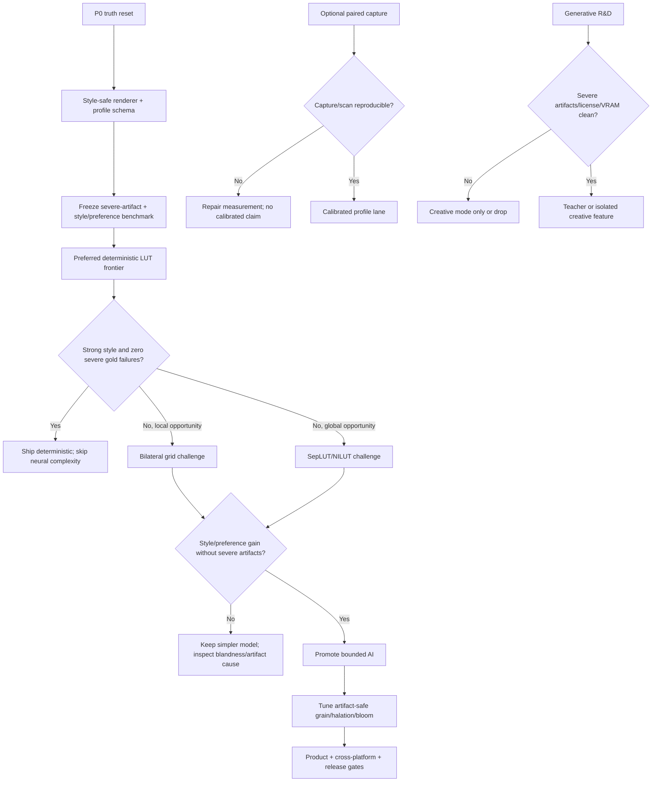

# K-MCFM Ultimate 路线图（2026-07-10）

> 状态：研究完成、等待执行决策；不是“已实现”声明。
> 适用仓库：`neuro_film` 当前分支及其后续演进。
> 核心判断：项目应从“扩散模型生成胶片感”转向“可校准的胶片成像系统”，并把生成式编辑隔离为可选创意模式。

---

## 0. 一页结论

用户在 2026-07-11 明确了 K-MCFM 的真正标准：**看起来很风格化，同时不能出现严重 glitch/artifact。** 因而产品目标不是最小化所有像素变化，也不是要求每个方案都精确复刻某一 stock，而是下面这个受约束优化问题：

> **在冻结 gold set 上零确认严重 artifact 的约束下，最大化可感知的胶片风格强度与用户偏好；在更大 stress set 上报告 artifact rate 和置信区间。**

这里的“严重 artifact”包括明显的人脸/肢体/对象/文字破坏、几何崩坏、VAE 涂抹、posterization/banding、大片 clipping、tile seam、异常色块、重复纹理和视频闪烁。强烈的 tone、color、grain、halation 和 bloom 是预期风格，不因变化大就自动算 artifact。

最终架构采用三层隔离：

1. **Style-safe 核心层（默认）**：确定性高精度色彩与受控物理效果；允许强烈风格化，但以严重 artifact gate 约束。
2. **Bounded AI 层（可选、仍属内容安全）**：小模型只预测曲线、LUT、双边网格和掩码等受约束参数；全分辨率渲染仍由确定性算子完成。
3. **Calibrated/Creative 分支（明确标注）**：自有实拍数据支持可选 calibrated profile；FLUX.2/Kontext 等生成模型只用于创意重绘或低分辨率教师探索。

决定项目上限的不是更大的扩散模型，而是四件事：

- 冻结的风格偏好锚点、严重 artifact 定义与压力测试集；
- 正确的场景线性、胶片密度、印放/扫描和显示变换边界；
- 分离“严重 artifact”“风格/偏好”“内容质量”“条件真实性”和“性能”的评测体系；
- 可审计的 profile、recipe、数据谱系、版本与发布许可证。

Style-safe 产品主线先围绕用户已偏好的 `53/55/56/09/01` 确定性家族建立风格前沿。**Portra 400 + Velvia 50** 保留为可选 calibrated 分支；只有带 calibrated/named-stock 强声明时，才必须经过自有配对数据、process/scan 解释和完整留出验证。

---

## 1. 研究契约与证据规则

### 1.1 研究问题

本路线图回答五个问题：

1. 当前仓库真正可用的基线是什么，哪些旧主张已被实验否证？
2. 2026 年可用的模型/渲染架构中，哪种最适合内容保真的胶片转换？
3. 要从“风格模拟”升级为“可验证的 stock/process/interpretation profile”，缺什么数据？
4. 什么评测能够阻止“自动指标很好、肉眼只是加饱和度”的再次发生？
5. 在 RTX 5070 Ti Laptop 12GB 与 M5 32GB 的约束下，怎样形成可发布产品？

### 1.2 证据等级

| 等级 | 可支持的主张 | 例子 |
|---|---|---|
| E0 设想 | 只能进入 backlog | 未实现架构、营销页推断 |
| E1 代码事实 | 可说明“代码存在” | 本地模块、schema、测试 |
| E2 本地实验 | 可说明“在固定样本上观察到” | 保存的 grid、JSON、报告 |
| E3 外部一手资料 | 可支持方法/接口/许可事实 | 论文、官方模型卡、厂商数据表 |
| E4 受控标定 | 可支持有限 stock/process 声明 | 自有色卡、阶梯曝光、固定冲扫 |
| E5 独立复现 | 才能支持强 calibrated 真实性声明 | 留出胶卷/实验室/相机与盲测 |

规则：低等级证据不得升级成高等级营销主张。厂商特性曲线是先验，不是端到端目标；无配对 Flickr 图是审美参考，不是 stock 真值；Capture One recipe 是软件风格监督，不是真实胶片扫描。

### 1.3 本次没有做的事

- 没有下载新模型或数据集；
- 没有启动 GPU/云训练、付费 API、实验室冲扫或外部消息；
- 没有修改当前渲染代码或覆盖用户未提交文件；
- 所有数量阈值都是首轮工程 gate，必须由 pilot 方差重新校准。

---

## 2. 当前仓库的事实基线

### 2.1 已经成立的能力

| 能力 | 证据 | 当前判断 |
|---|---|---|
| 内容安全颜色基线 | `safe_lab`、`safe-rich` 及固定分辨率渲染报告 | 可作为 legacy fallback；几何不变 |
| 确定性效果 | grain、halation、dust 已进入 CLI | 可用于工程基线，但参数尚非真实 stock 标定 |
| 输入抽象 | `WorkingImage`、raster/RAW 解码模块 | 方向正确；尚未接到主 `render_film.py` 路径 |
| 小型颜色模型探索 | SepLUT/NILUT/4D proxy、本地 bounded maps | 有实验资产；训练目标仍是 pseudo-teacher 或自动门槛 |
| FiveK 中性 auto-base | ICC 修复后的 freeze pack 与 V6 候选 | 只能作为中性预处理研究，不能代表胶片身份 |
| 测试 | 18 个本地测试当前通过 | 有最小回归网；覆盖范围与 CI 仍不足 |

### 2.2 已被本地实验否证的旧主线

1. SD1.5 IP2P 微调产生严重 painterly smearing。
2. SDXL full-UNet IP2P 在 12GB GPU 上即使 128/256px、checkpointing、8-bit Adam 仍 OOM。
3. SDXL LoRA + SDEdit 在低 strength 几乎不变，中 strength 开始重写人物、衣物和细节。
4. Local bounded maps 虽通过旧自动门槛，用户观察仍主要是加饱和度，说明门槛没有测到 stock identity。
5. Neural LUT V2 主要蒸馏 `film_response_v1` pseudo-target；它证明工程形式可行，但没有证明真实胶片准确性。

本次研究开始时，`AGENTS.md`、`IMPL_PLAN.md`、`TASK_BOARD.md` 仍把 diffusion-first 写成现行方向；`U0.1` 已在 2026-07-10 完成纠偏。保留下来的 V3 内容现在只作为有明确 supersession 标记的历史，不再是现行架构事实。

### 2.3 当前最危险的缺口

| 缺口 | 后果 | 优先级 |
|---|---|---:|
| 主 CLI 仍以 PIL 8-bit RGB 读写，未使用 `WorkingImage` | RAW/HDR/ICC/16-bit 价值在最后一公里丢失 | P0 |
| FiveK 全量源数据已删除，只剩 6.98GB freeze pack | 旧 tracker 的“可全量训练”假设失效 | P0 |
| Flickr manifest 缺少可靠 uploader/group/source lineage，且有跨 split 近重复 | 泄漏与权利边界不可审计 | P0 |
| FilmSet target 来自 Capture One recipes | 不能用于“真实胶片”强声明 | P0 |
| 项目文档声称 MIT，但仓库根目录没有 `LICENSE` | 对外发布阻塞 | P0 |
| 没有 CI，只有 5 个测试文件/18 个测试 | 跨平台和色彩回归风险高 | P0 |
| 现有 halation 数值被规范明确标记为 heuristic | 可以叫“物理启发”，不能叫“stock calibrated” | P1 |

---

## 3. Ultimate 的可验证定义

### 3.1 两种输入契约

#### Style-safe mode（产品默认）

普通 JPEG/HEIC/PNG、已知或未知后期图片都可以进入强风格化流程。系统必须保留输入色彩状态提示，但这不会阻止 `film-inspired` look；晋级依据是风格/偏好和严重 artifact gate，而不是 stock 准确性。

#### Reference mode

只在输入色彩状态可证明时启用：相机 RAW/DNG、已知 log、带可靠 ICC/传递函数的 HDR/SDR，或已知 scene-linear 数据。输出可以做 stock/process/interpretation 级别的受限真实性声明。

#### Look Approximation mode

用于普通 JPEG、未知后期图片、社交媒体下载图。系统必须明确提示：原始辐射度、相机处理和白平衡无法恢复；结果是“从当前显示图像出发的 look approximation”，不是参考级胶片再现。

当输入色彩状态不明时，系统应 fail closed 到 Approximation，而不是猜测并继续使用 Reference 标签。

### 3.2 三种产品标签

| 模式 | 可改变什么 | 禁止什么 | UI/元数据标签 |
|---|---|---|---|
| Style-safe（默认） | 强烈曲线/LUT/grid/effect 风格化 | 已定义的严重 glitch/artifact | `film-inspired` |
| Calibrated Reference | 固定网格颜色/效果 + 有证据的 stock/process/interpretation | 未经证据的真实性声明 | `calibrated-reference` |
| Creative Generative | 可生成或重绘 | 不得冒充 artifact-safe 或 calibrated 结果 | `creative-generative` |

### 3.3 产品级 DoD

“Ultimate v1”至少满足：

- 至少两种在盲测中明显风格化并优于寡淡基线的核心 look；
- 冻结 gold set 上 0 个确认严重 artifact，并在更大 stress set 上报告 artifact rate/CI；
- RAW、带 ICC 的 16-bit TIFF、普通 JPEG/PNG 的明确输入契约；
- 16-bit SDR 输出和可追溯 recipe/profile；
- Style-safe 路径稳定、可复现且不会产生严重内容/几何/色彩崩坏；
- 24MP 与 100MP 的 tile-safe 导出，无接缝；
- Windows 12GB、Apple Silicon、CPU fallback 均通过固定 benchmark；
- 数据卡、模型卡、profile card、许可证和第三方归属完整；
- 盲测风格强度、偏好和 artifact severity 通过，且失败样本公开记录；
- 若发布 calibrated profile，再额外满足 E4/E5 配对数据和完整胶卷/实验室留出；
- Creative 模式在代码、UI、输出目录和元数据上与 Style-safe/Calibrated 隔离。

---

## 4. 目标架构：校准优先的混合胶片成像系统

```mermaid
flowchart LR
    A["RAW / Log / HDR / SDR"] --> B["Ingest + Color-state validation"]
    B --> C{"Color state known?"}
    C -->|Yes| D["Reference working space\nfloat16/32 scene-linear"]
    C -->|No| E["Look Approximation\ndisplay-referred"]
    D --> F["Optional neutral auto-base"]
    E --> F
    F --> G["Stock exposure + sensitometry\nmonotone 1D curves"]
    G --> H["Dye/crosstalk + global color\n3D LUT / NILUT / SepLUT"]
    H --> I["Bounded local residual\nbilateral grid + masks"]
    I --> J["Interpretation\nnegative→scan/print; slide direct; B&W process"]
    J --> K["Exposure-domain halation"]
    K --> L["Density-aware grain + MTF"]
    L --> M["Bloom / dust / optical options"]
    M --> N["OCIO/ACES output transform\nSDR / P3 / HDR / gain map"]
    N --> O["Image + recipe + provenance"]
    P["Tool agent"] -->|"validated parameter JSON only"| F
    Q["Creative generator"] -.->|"isolated mode"| O
```



### 4.1 Stage 0：输入与色彩状态

`WorkingImage` 应成为唯一主入口，而不是旁路实验模块。最小数据契约：

```text
pixels: float16/float32
dimensions, orientation, alpha
source_referred: scene | display | unknown
primaries, white_point, transfer_function
icc/dng/log transform identity + hash
camera/lens/exposure/ISO/WB metadata
source file hash and decode version
valid range + negative/headroom policy
```

执行原则：

- RAW 先保留 scene-linear 关系；generic rawpy 路径只能叫 generic development。
- ICC 必须做真实 profile transform，不能只调用 `convert("RGB")`。
- 内部优先采用 ACEScg 或经验证的 scene-linear working space；归档交换可使用 ACES2065-1。
- 胶片扫描中间数据可评估 ACES ADX/ADX16，但必须保存原始 scanner RGB 与变换版本。
- HEIF/Ultra HDR/gain map 未识别时必须警告或拒绝 Reference 模式。
- 每一步记录 source/display referred 边界，禁止在不知情时重复 gamma 或 tone map。

ACES 是颜色管理框架，不会自动提供相机真实性；仍需正确 IDT/DNG/相机 profile。OpenColorIO 负责可靠执行与配置版本化，不替代标定。

### 4.2 Stage 1：中性 auto-base

FiveK 路径只用于可开关的“数字底片中性化/自动起点”，不得与 stock identity 绑定。

- 默认 Reference profile 可关闭 auto-base，避免自动白平衡覆盖胶片特征。
- 若开启，输出必须保留 exposure/WB/tone 参数，允许用户逐项撤销。
- 当前 freeze pack 足够做回归和小型试验；任何 FiveK 全量训练都需先恢复源数据并重新核验许可与 ICC。
- auto-base gate 应测“可编辑起点”和主观可用性，不能只看接近 Expert C 的像素误差。

### 4.3 Stage 2：stock exposure 与 sensitometry

每个 profile 的核心不是任意 LUT，而是显式、单调、可检查的曝光响应：

```text
scene exposure
  -> stock exposure offset / EI
  -> per-layer or per-channel log exposure
  -> monotone H&D / density curves
  -> cross-channel dye coupling
  -> residual color transform
```

实现建议：

- 以单调样条或约束 1D LUT 表示 toe、straight line、shoulder；
- 厂商 characteristic curves、spectral sensitivity、spectral dye density、MTF/granularity 只做正则化和初始化；
- 真实自有标定 patch 决定最终参数；
- 训练时约束单调性、曝光序列顺序与跨 illuminant 稳定性；
- profile 明确 EI、冲洗流程、批次与温度；push/pull 是 process variant，不是简单全局 exposure slider。

### 4.4 Stage 3：全局颜色与 bounded local residual

候选按复杂度逐级挑战：

1. 1D tone + 33³/65³ tetrahedral 3D LUT；
2. SepLUT / NILUT；
3. 低分辨率 bilateral grid，切片后在全分辨率应用局部仿射颜色；
4. 只有前三者无法达到 gate 时，才考虑更复杂的上下文模型。

受约束模型只能输出：

- 单调曲线控制点；
- LUT residual；
- bilateral grid coefficients；
- 低频 mask 或语义区域权重；
- 可读的效果参数。

它不得输出最终 RGB 图，不得使用空间 warp，不得合成毛孔、文字、衣物或对象。这样“内容保真”由架构保证，而不是由 SSIM 猜测。

推荐模型形态：256–512px 预览输入的小型 encoder，输出全局参数与低分辨率 grid；最终 24MP/100MP 由 CPU/CUDA/Metal 的确定性 slicer 和 LUT 核执行。模型应小于硬件预算，而不是为了追求某个参数量数字。

### 4.5 Stage 4：interpretation 是一等公民

“胶片原片”并不是单一最终 RGB 外观：

- **彩色负片**：`stock + C-41/ECN-2 + scanner/neutral inversion` 或 `stock + print stock/paper + display scan`；
- **电影负片**：至少区分 neutral scan 与 print-film interpretation；
- **反转片**：直接形成观看正像，但仍受光源、冲洗和扫描影响；
- **黑白负片**：stock 必须绑定 developer、稀释、时间、搅拌、印相纸/扫描解释。

因此 profile ID 应类似：

```text
portra400/c41/lab-A-neutral-scan/v1
vision3-500t/ecn2/2383-print/v1
velvia50/e6/direct-scan/v1
trix400/d76-1plus1/neutral-scan/v1
```

默认 profile 可以做友好别名，但 UI 必须允许查看完整链路。竞争产品公开描述的实拍 film profile 流程也说明：真正的壁垒是胶片、曝光、冲洗、数字基线和解释链的标定，而不是 stock 名称 prompt。

### 4.6 Stage 5：物理效果域

顺序建议：

1. halation 作为胶片内部散射，在 latent exposure/density 响应附近注入；
2. stock/development 对应的 density-aware grain；
3. stock/scanner/lens MTF 与分辨率；
4. scanner/镜头 bloom；
5. dust、scratch、light leak 等明确标为创意或归档缺陷层。

当前 halation 可保留为 legacy display-level fallback，但 ultimate 路径需要：

- 真实高光 patch 的径向剖面、颜色泄漏、暗侧选择性和 exposure 依赖；
- 负片/反转片/电影片分别标定；
- tile halo 与 100MP 无接缝测试；
- 视频时加入时间一致性；
- bloom 与 halation 拆开评测和控制。

grain 使用干净室实现的随机几何/统计模型或自有代码；IPOL 的物理胶片颗粒论文可作为算法依据，但其 GPL 实现不能直接复制进宣称 MIT 的核心代码。grain 需要匹配 NPS、自相关、粒度、曝光/密度依赖、输出尺寸和查看倍率，而不是简单叠加固定高斯噪声。

### 4.7 Stage 6：输出与非破坏性 recipe

每次输出必须绑定：

- 输入 hash、decode transform、working/output color space；
- profile ID/version/hash、模型/代码 commit；
- 随机种子、所有参数与自动决策；
- Style-safe/Calibrated/Creative 标签；
- SDR/P3/HDR/gain-map 输出 transform；
- 第三方 profile/model/data attribution。

recipe 应可跨 CLI、API、GUI 重放；图片导出与 sidecar JSON/XMP 一起测试。输出至少支持 16-bit TIFF/PNG；JPEG/HEIF 是分发格式，不应是内部主表示。

---

## 5. Profile 数据模型

建议以版本化 JSON schema 作为唯一事实源：

```yaml
profile_id: portra400/c41/lab-A-neutral-scan/v1
display_name: Kodak Portra 400 — C-41 Neutral Scan
stock:
  family: color_negative
  manufacturer: Kodak
  nominal_iso: 400
process:
  chemistry: C-41
  lab: coded-lab-A
  batch_ids: [redacted-or-owned-identifiers]
interpretation:
  type: neutral_scan
  scanner: scanner-model-and-profile
color_contract:
  input: scene_linear
  working_space: ACEScg
  output_views: [sRGB, Display-P3]
calibration:
  evidence_grade: E4
  illuminants: [D55, tungsten-3200K, LED-set-1]
  exposure_range_ev: [-3, 3]
  held_out_rolls: 1
model:
  sensitometry_curves: curve-asset-hash
  global_lut: lut-asset-hash
  local_grid: optional-model-hash
effects:
  halation: parameter-asset-hash
  grain: parameter-asset-hash
rights:
  data_manifest: manifest-hash
  redistribution: internal|research|commercial-cleared
validation:
  report: report-hash
  known_failures: [mixed-led-metamerism]
```

Profile card 必须区分：

- `heuristic`：视觉调参；
- `measured-lab`：图表或局部测量；
- `paired-scenes`：真实配对场景；
- `independent-held-out`：独立胶卷/实验室留出通过。

---

## 6. 数据战略：从“风格图片”转向“测量系统”

### 6.1 现有数据如何使用

| 数据 | 可以做 | 不可以做 |
|---|---|---|
| raw.pixls.us 逐文件可核 CC0 RAW | RAW 解码、相机域和内容安全回归 | 胶片真值；未核清的 legacy 样本 |
| Flickr 胶片扫描 | 无配对审美参考、失败模式、内部偏好研究 | 商业权重默认训练、真实性真值 |
| FilmSet | Capture One recipe 复现、软件风格 warmup | 真实 film stock ground truth |
| MIT-Adobe FiveK | 中性 auto-base 研究与 freeze regression | film identity；未核权前发布训练权重 |
| PPR10K | 研究用人像局部编辑基线 | 商业模型默认训练 |
| Cinestill 41 对 | 外部小样 smoke test | 统计充分的真实性 benchmark |
| BlueNeg | 历史底片修复域外压力测试 | 现代 stock look 或数字/胶片配对真值 |
| FilmGrainStyle740k | 按原条款做学术颗粒对照 | 商业开发/训练；真实颗粒真值 |
| 厂商技术 PDF | 曲线/敏感度/MTF/granularity 先验 | 完整 scanner RGB 映射 |
| 社区 LoRA | Creative mode 候选、提示词对照 | Reference 核心或商业默认依赖 |

立即动作：为所有现有 manifest 增加 `source_url`、`uploader/group_id`、`capture_or_scan_id`、`license_snapshot`、`rights_scope`、`split_group`、`content_hash`、`perceptual_hash`、`derived_from`；按 scene/roll/uploader 分组后重新划分，清除跨 split 近重复。

### 6.2 自有 paired calibration pilot

首轮只做两种 stock：Portra 400 与 Velvia 50。目的是验证测量闭环，而不是堆数量。

可借鉴的近期最小标定先例是 [Emulating Emulsion](https://musicofmusix.github.io/siggraphposters25)：其摘要报告用一卷 Velvia 100、96 个色块、3 种照明和 11 档曝光形成 3168 个 patch pairs，并拟合约 30 参数的紧凑模型。它说明“小而受控的测量 + 物理参数”值得优先，但只覆盖正片颜色、没有公开数据/代码，也不包含 grain/halation；因此这里只借鉴实验形状，不把其数值当本项目 benchmark。

#### 拍摄矩阵

- illuminant：约 D55 日光、3200K tungsten、代表性高 CRI LED、至少一种困难 mixed light；
- exposure：-3EV 至 +3EV 阶梯，关键区间用 1/3 或 1/2 stop；
- charts：ColorChecker、灰阶/step wedge、饱和色、肤色、分辨率/MTF chart；
- scenes：肤色、叶片、天空、暖灯、霓虹、高动态范围、细字/织物、镜面高光、深阴影；
- repetition：每 stock 至少 3 个独立 roll，并覆盖至少 2 个有完整记录的 process session；pilot 后用方差分析调整；
- metadata：镜头、光圈、快门、测光、滤镜、温湿度、胶卷批号、实验室、化学流程、scanner 与软件版本。

#### 配对方式

Pilot 可先用刚性三脚架、静态场景、短时间顺序拍摄，并在两套系统中放置曝光/白平衡参考。Ultimate 数据再评估同轴 beam-splitter rig；beam splitter 本身的光谱、偏振与透过率必须测量，不能假设它无色。

数字端保留 RAW；胶片端保留未经自动增强的 scanner raw/高位深主文件、ICC/IT8 标定与完整 negative/slide scan。任何实验室自动色彩都应作为独立 interpretation target，而不是混入 stock 真值。

#### 数据拆分

- 以 scene + roll + lab/session + subject 为 group；
- 验证集留出完整 roll；
- 最终测试至少留出一个新 process batch，理想情况下再留出新 lab/scanner；
- chart patch 不能随机拆到 train/test 两侧；
- 同一场景不同曝光属于一个 group；
- 记录人工剔除原因，禁止只保留“看起来成功”的帧。

#### 数量策略

工程起点：每 stock 30–50 个有效场景、至少 3 个 roll、至少 2 个 process session，加完整 chart/exposure 序列；闭环稳定后扩到每 stock 至少约 100 个有效配对场景。这里的数字不是统计保证；在 pilot 后用 roll/lab 间方差、效果量和置信区间决定扩量。

### 6.3 扩展 stock 顺序

| 波次 | Stock | 原因 | 先决条件 |
|---|---|---|---|
| Pilot | Portra 400 | 彩负、肤色、宽容度、产品价值高 | C-41 + neutral scan 定义 |
| Pilot | Velvia 50 | 反转片、高饱和、与彩负正交 | E-6 与受控扫描 |
| Wave 2 | Vision3 500T / 250D | tungsten/daylight 电影链 | ECN-2 + neutral/print 分开 |
| Wave 2 | Ektar 100 / Portra 800 | 彩负内部泛化 | Pilot pipeline 通过 |
| Wave 3 | Tri-X 400 / HP5 Plus | 黑白颗粒与 developer 依赖 | process/paper schema 已实现 |

---

## 7. 模型与训练方案

### 7.1 一个变量一轮的挑战阶梯

每个 stock/process profile 使用同一数据 split、同一输出解释和同一评测：

| 级别 | 候选 | 晋级条件 |
|---|---|---|
| B0 | 当前 `safe_lab` / safe-rich | legacy 下限 |
| B1 | 强风格 1D curves + 3D LUT | 必须优于偏好锚点的 style/appeal 且无 severe artifact |
| B2 | SepLUT / NILUT | 只有 B1 风格前沿仍有明确空间时进入 |
| B3 | bilateral grid / HDRNet-style | 只有局部场景自适应能提高偏好且不增 artifact 时进入 |
| B4 | bounded semantic masks | 只有 B3 在肤色/天空等区域仍系统失败时进入 |
| G | diffusion/generative | 永不与 B0–B4 共用 Reference 晋级门槛 |

简单模型若达到 style/artifact gate，立即停止增加复杂度。现有 NILUT/SepLUT 代码可用于 Style-safe challenger，但训练目标必须来自权利清晰的输入和冻结偏好/目标；pseudo-teacher 只能支持“复现该风格目标”的证据。只有 calibrated lane 才必须改用真实 paired target，并且不能把 pseudo-teacher 成绩当作真实性证据。

### 7.2 损失与约束

训练目标分开记录，禁止只优化一个平均 perceptual loss：

- controlled chart：ΔE00/HyAB、log exposure curve、channel order、neutral axis；
- scene color：robust Lab/linear RGB loss、hue/chroma by exposure、highlight/shadow tail；
- structure：禁止 resampling；grid smoothness、mask TV、parameter bounds；
- generalization：roll/lab/illuminant/camera group holdout；
- effects：halation radial profile、grain NPS/autocorrelation、MTF；
- preference：Style-safe 主线的核心优化信号；calibrated lane 中仍不能替代真实性监督。

所有 checkpoint 保存：数据 manifest hash、split hash、配置、seed、代码 commit、依赖 lock、设备、训练日志、完整评测和失败样本。

### 7.3 生成式模型的正确位置

截至 2026-07-10，FLUX.2 Klein 4B 是值得跟踪的新候选：4B 权重为 Apache-2.0，支持单/多参考编辑，官方仓库称约 8GB，而官方 Hugging Face 模型卡称约 13GB。对 12GB Laptop GPU 必须先用 FP8/offload 做实测，不能写成确定支持。

它可用于：

- Creative mode；
- 低分辨率“想要的方向”教师，再把结果拟合为受约束 LUT/grid；
- 少量 paired edit LoRA 的研究分支。

它不可用于：

- Reference 默认像素渲染；
- 在没有真实 paired data 时制造“胶片真值”；
- 将 50–200 个营销示例数量当作本项目充分样本量；
- 未经单独 GPU/许可审批就启动训练。

InstantRetouch 的“扩散教师蒸馏到 bilateral space”与 HDRNet/3D-LUT 系列支持本项目的 bounded-AI 方向；但其仓库当前没有足以作为本项目即插即用依赖的成熟预训练资产。借鉴架构，不绑定上游。

### 7.4 自然语言与个性化

“AI 操作”默认是工具代理，不是像素生成器：

```json
{
  "profile": "portra400/c41/lab-A-neutral-scan/v1",
  "exposure_ev": 0.3,
  "print_contrast": -0.1,
  "grain_amount": 0.25,
  "halation_amount": 0.12,
  "skin_protect": 0.7
}
```

JSON 经过 schema、范围、互斥规则和 preview diff 验证后才执行。IEA、RetouchIQ 等 2026 工作说明“让语言模型调用明确的修图工具/参数”是一条合理方向，但本项目必须用自己的安全 schema 和 benchmark 验证。

个性化可在 v1 之后引入：从 A/B 选择学习用户偏好，优化低维参数或 profile mix；calibrated profile 的证据参数保持不变，个人偏好作为独立 recipe overlay。RLPixTuner 一类低查询控制优化可作为研究参考。

---

## 8. 评测系统：五张独立成绩单

### 8.1 A：严重 glitch/artifact 一票否决

Style-safe 产品不是要求“几乎不改变输入”，而是允许很强的风格，同时拒绝明显损坏成片的失败。严重程度由预先冻结的正例/反例手册定义：

| 级别 | 示例 | 处理 |
|---|---|---|
| Severe | 人脸/肢体/对象/文字破坏，几何崩坏，大片 VAE 涂抹，posterization/banding，大片 clipping，tile seam，异常色块，重复纹理，视频闪烁 | 一票否决 |
| Moderate | 局部 halo、肤色偏移、细字轻微模糊、颗粒过粗、局部色噪 | 降低质量/偏好排名，是否阻断由预注册规则决定 |
| Intended style | 强 tone/color、toe/shoulder、grain、halation、bloom、可控 softness | 不因变化明显就算 artifact |

Gold set 覆盖脸、手、文字、织物、树叶、天空/墙面渐变、霓虹、高光、深阴影、饱和物和 tile 边界。产品 gate 为 **0 个经人工确认的 severe artifact**；更大 stress set 报告发生率、95% CI、最差场景和类型分布，不声称现实世界绝对零缺陷。

SSIM/CW-SSIM/GMSD/DISTS、OCR、face/keypoint、clipping、banding 和 seam detector 只做筛查与定位，最终 severe 判定由冻结 rubric + 盲化人工复核完成。旧 L-SSIM 不能因为风格变化大就把好方案误杀。

### 8.2 B：可感知的胶片签名

用户明确指出：很多理论指标更好的方案看起来依然没有什么胶片风格。因此，“技术正确”只负责不出错；真正优化目标是在通过 severe gate 的候选中尽量提高风格强度与吸引力。

这一成绩单回答三个独立问题：

1. 与 neutral digital input/当前寡淡基线相比，观察者能否稳定感知到胶片化方向？
2. 它是否读作胶片成像特征，而不是单纯加饱和、压黑、泛黄或叠噪声？
3. 该签名能否跨肤色、天空、绿植、夜景、中性灰和不同曝光保持，而不是只在精选图片上成立？

验证设计：

- 先做 color-only 盲测，关闭 grain/halation/bloom，防止效果层掩盖色彩模型寡淡；
- 再做 full-look 盲测，验证完整体验；
- 同时展示 neutral input、当前偏好冠军、候选和真实 film reference；
- 诊断 exposure-dependent hue、toe/shoulder、neutral-axis、局部对比与色域行为，但不把 global chroma 增量当作晋级指标；
- 用 `53/55/56/09/01` 作为第一代完整偏好锚点，并在同一冻结图集上重渲染；
- 同时记录 style strength 和 overall appeal，避免“风格最重”被误当作“最好看”。

晋级顺序为：先通过 severe artifact gate，然后在幸存候选中寻找 style strength × appeal 的 Pareto 前沿。技术上更优但肉眼寡淡的方案在此停止；风格很强但不像目标 stock 的方案可以作为 `film-inspired` look 发布，只是不能标 calibrated。

2026-07-11 首轮视觉审计把下一目标进一步收敛为：**#56 式青蓝阴影/暖红橙黄的调色强度 + #09 式输出 containment，并修复红光金属区域出现的局部 neon-red chroma speckling。** 证据与八候选 bridge sweep 见 `docs/VISUAL_STYLE_AUDIT_2026-07-11.md`。

### 8.3 C：内容与效果质量（分级诊断）

通过 severe gate 后，仍需用连续指标区分“优秀”和“勉强可用”：

- 尺寸、裁切、alpha、tile 与 seed determinism；
- edge/keypoint、OCR、face/skin、细纹理与局部对比；
- clipping、banding、posterization、halo、color blotch 和 seam 强度；
- grain 的均匀性/密度依赖，halation/bloom 的边缘质量，MTF/softness；
- 按脸、文字、天空、绿植、夜景、高光和相机来源报告 P50/P95/最差样本。

这些指标用于排序和定位，不要求输出接近输入。一个强烈且好看的色调变化可以比寡淡方案获得更低 SSIM，却仍是更好的产品结果。

### 8.4 D：Calibrated 真实性与物理性（条件成绩单）

只有 profile 使用 `calibrated-reference` 或强 named-stock 声明时，下面的 stock/process/interpretation 指标才是晋级硬门：

| 维度 | 指标 |
|---|---|
| Sensitometry | 各通道 log-exposure/density curve RMSE、toe/shoulder/slope 偏差 |
| Color | chart median/P95 ΔE00 或 HyAB、neutral axis、skin/foliage/sky hue error |
| Exposure | -3..+3EV 序列顺序、highlight/shadow tail、跨 EV 色偏 |
| Illuminant | daylight/tungsten/LED 分组结果，不只报总体平均 |
| Generalization | 新 roll/lab/scanner/camera/session 的独立结果 |
| Identity | stock 识别与真实 scan 匹配，和“更喜欢哪张”分开 |

Calibrated pilot 暂定 gate（随后由方差重定）：

- 相对最佳非学习基线，受控 chart 与真实场景的主要真实性指标都有统计上稳定的改善；
- 不能以平均改善掩盖 P95/最差场景退化；
- 完整留出 roll 不劣化；
- 盲测 stock-match 胜率的 95% CI 下界高于 50%；目标为明显高于 60%，但不提前把该数值当科学定律。

物理效果在 calibrated lane 额外检查：

- grain：2D NPS、径向 NPS、自相关、density dependence、色层相关、输出尺寸/缩放稳定性；
- halation：径向强度、半径、红/橙谱偏、暗侧泄漏、source selectivity、exposure dependence；
- MTF：边缘扩散/线对、方向性；
- bloom：与 halation 独立；
- 视频：帧间参数、grain 时间行为和闪烁。

一个没有 calibrated 证据但强风格、无 severe artifact 的方案可以进入 `film-inspired` 产品；profile card 必须明确证据等级，避免把审美成功包装成测量真实性。

### 8.5 E：产品与性能

固定设备矩阵：Windows RTX 5070 Ti Laptop 12GB、M5 32GB、CPU fallback。

测量 cold/warm：decode、preview、full render、encode、峰值 RAM/VRAM、24MP、100MP、batch、tile seam、determinism。首版性能目标仅作为工程预算：

- 预览交互不阻塞，允许分辨率分级与缓存；
- 24MP Reference 渲染在目标设备上达到“秒级”而非分钟级；
- 100MP 使用受控 tile/halo，峰值内存不随像素数无界增长；
- GPU 不可用时结果质量一致，只有速度下降；
- bounded predictor 失败时自动回退确定性 Style-safe 核心。

精确时延 SLO 只在参考实现 benchmark 后冻结。

### 8.6 主观实验设计

- 已知个人偏好锚点：用户在 2026-07-11 指定 Velvia 50 总表中的 `53, 55, 56, 33, 09, 03, 02, 01`。其中 `53/55/56/09/01` 各有 20 张完整输出，均属于确定性 baseline 或 gamut-safe Lab 家族；`33/03/02` 只有 1–2 张 smoke，只能作为方向提示。下一轮应把五个完整方案统一到同一冻结图集并盲化复测；该偏好不能替代真实胶片真实性评测；
- 随机、盲化、配对展示输入、当前偏好锚点、K-MCFM 候选和合法获得的竞争参考；真实 scan 只在 calibrated 评测中作为真实性参考；
- 主产品分开问“风格有多强”“有多喜欢”“是否存在 severe artifact”；calibrated 分支再问“更像目标 stock/process 吗”；
- 场景、stock、观察者做分层；
- 使用 Bradley–Terry 或 mixed-effects 分析并报告置信区间；
- 预注册排除规则、样本量和主指标；
- 保存所有失败样本，不只做 contact-sheet 精选。

---

## 9. 产品形态

### 9.1 CLI/API 先行

先冻结可复现 reference engine，再做 GUI：

```bash
kmcfm inspect input.dng
kmcfm render input.dng \
  --profile portra400/c41/lab-A-neutral-scan/v1 \
  --mode reference \
  --recipe out.json \
  --output out.tif
kmcfm verify out.json
kmcfm benchmark --suite reference-24mp
```

核心 API 应是纯函数式 recipe → render，GUI 只组合参数。这样 CLI、batch、desktop、plugin 和服务端不会出现多套颜色逻辑。

### 9.2 Desktop Ultimate UX

- RAW browser + background preview cache；
- Before/After、split view、100% texture view、false-color clipping；
- profile card 展示 stock/process/interpretation/evidence grade；
- exposure、print/scan、color、grain、halation、bloom 分组；
- 非破坏性 history、copy/paste、batch、favorite recipe；
- “Style-safe / Calibrated / Creative” 永久可见，切换有解释；
- input color-state 警告和 Approximation 降级提示；
- 导出前显示输出 gamut/HDR/bit-depth/profile；
- 所有自动参数可展开、锁定和重置。

### 9.3 平台策略

- Python/NumPy/PyTorch 先做 style-safe truth implementation；
- 性能核只在 profile 和评测冻结后迁移到 C++/Rust/Metal/CUDA；
- Windows 优先 ONNX Runtime/CUDA 或小型 PyTorch 模型；
- Apple 路径优先 Core ML/Metal 验证；转换失败时 deterministic CPU/Metal fallback；
- LUT、curves、grid slicer 和 effects 保持后端无关测试向量；
- 不为“原生化”提前复制两套算法。

---

## 10. 条件研究树与停止规则



硬停止规则：

- 没有自有/cleared paired data：可以发布明确标记的 `film-inspired` look，但不得宣传“准确再现某胶片”；
- 输入色彩状态不明：可以走 Style-safe，但不得标 Calibrated Reference；
- 简单模型达到 style/artifact gate：停止增加网络复杂度；
- bounded AI 没有稳定 style/preference 增益，或在 gold set 出现任何确认 severe artifact：不晋级；
- 生成模型产生严重内容/几何/纹理 artifact：不进入 Style-safe/Calibrated；只留 R&D 或丢弃；
- 许可证或训练数据来源不清：不得发布相应权重/profile；
- 12GB 实测 OOM：只允许量化/offload 研究，不修改主产品硬件承诺；
- 需要付费数据、实验室、云 GPU、公开发布或外部消息：先取得人工批准。

---

## 11. 分阶段路线与资源

### Phase 0：Truth reset（1–2 周）

交付：现状文档纠偏、LICENSE 决策、数据 manifest/schema、去重与 split 审计、CI、固定 benchmark pack。
退出：新会话不再把 diffusion-first 当当前事实；每个数据样本和基线结果可追溯。

### Phase 1：Color foundation（2–4 周）

交付：`WorkingImage` 接主 renderer；scene/display 状态；ICC/RAW/16-bit；profile/recipe schema；tile-safe 基础。
退出：同一输入/recipe 在三后端达到定义容差；未知色彩状态正确降级。

### Phase 2：Style-safe renderer（3–5 周）

交付：强风格曲线/global LUT、profile/recipe、legacy safe_lab 兼容、`film-inspired` 标签。
退出：可重放，强风格候选可生成，严重 artifact 类型有明确保护和回退。

### Phase 3：Artifact/style benchmark（2–4 周）

交付：gold/stress sets、severity rubric、`53/55/56/09/01` 同图重渲染、style strength/appeal 盲测。
退出：gold set 0 确认 severe artifact；候选在风格/偏好上明显优于寡淡基线。

### Phase 4：Bounded AI challenge（3–6 周）

交付：B1–B4 公平挑战、ablation、模型卡、跨场景 stress 结果。
退出：只有提高 style/preference 且不产生 severe artifact 的最简单候选进入产品；允许结论为“无需 AI”。

### Phase 5：Physical effects（3–6 周，可与 Phase 4 部分并行）

交付：曝光域 halation、density-aware grain、MTF、bloom 分离、100MP tile、视频研究报告。
退出：效果提升 full-look 偏好且不触发 severe artifact；heuristic 与 calibrated preset 分开。

### Optional Calibrated Lane：Paired pilot（4–8 周，可并行）

交付：Portra 400 + Velvia 50 charts/scene/EV/roll 数据、扫描标定、E4 profile、留出报告。
退出：process 和 scan 重复性足以分辨模型误差；只约束标记为 calibrated 的 profile，不阻塞 Style-safe 产品。

### Phase 6：Productization（6–10 周）

交付：CLI/API、desktop、batch、cache、recipe、Windows/Mac/CPU、installer、错误恢复、性能报告。
退出：golden corpus、跨平台、长批处理、崩溃恢复、色彩导出测试通过。

### Phase 7：Expansion and release（持续）

交付：Wave 2/3 stocks、tool agent、个性化、Creative mode、数据/模型/profile card、公开 benchmark。
退出：许可、商标/命名、隐私、归属和发布审批完成。

#### 人力与日历估计

- 1 名强工程师 + 按需色彩科学/实验室支持：研究级双 stock v1 约 5–8 个月，完整产品约 9–12 个月；
- 2–3 人（color/style、engine/product、QA/infra）可并行缩短；主产品关键路径是 artifact/style 人评，实验室批次只约束可选 calibrated lane；
- 远程大 GPU 不是 P0；主要计算可在现有 12GB GPU/M5 完成。只有生成式 LoRA 或大规模对照试验可能需要付费 24GB+ 资源，必须单独批准。

这些是范围估计，不是工期承诺；Phase 3 的测量质量决定后续是否值得扩张。

---

## 12. 风险登记

| 风险 | 概率/影响 | 早期信号 | 缓解/回退 |
|---|---|---|---|
| 数字/胶片配对不准 | 高/高 | 边缘双影、动态场景漂移 | 静态 rig、标志点、分组剔除、测量 rig |
| lab/scanner 变化大于 stock 信号 | 高/高 | 同 stock 跨批差异过大 | 重复 roll、固定 SOP、分层 profile |
| “负片 look”定义含混 | 高/高 | 评审偏好互相矛盾 | stock/process/interpretation 拆分 |
| 现有数据权利不清 | 高/高 | 无 license snapshot/uploader | 研究隔离、自有数据、发布 gate |
| ICC/HDR 处理错误 | 中/高 | 肤色/白平衡系统偏差 | color-state contract、golden vectors、fail closed |
| AI 只学到饱和度 | 高/中 | 自动指标过、stock 盲测不过 | 曝光/stock 指标、真实 paired holdout |
| 12GB OOM | 中/中 | 官方显存口径冲突 | 主路径 tiny/bounded；FP8/offload 仅 R&D |
| profile 过拟合单实验室 | 高/高 | 新 batch 崩溃 | 完整 roll/lab 留出、层级 profile |
| 100MP tile 接缝 | 中/中 | 大 blur/halation 边界 | halo-aware tiling、reference full-frame 对照 |
| Mac/Windows 数值漂移 | 中/中 | LUT/grid 输出差异 | 后端无关 test vectors、容差规范 |
| 文档再次漂移 | 高/中 | AGENTS 与实际代码矛盾 | active pointer、agent log、release checklist |
| 商标/产品命名 | 中/高 | 对外宣称官方 stock | 法务审查、兼容性措辞、profile provenance |

---

## 13. 成功指标

North Star 是一个主目标加四个约束/支持指标：

1. **Style × appeal（主目标）**：通过 severe gate 的候选中，盲测风格强度和总体偏好优于 `53/55/56/09/01` 统一重渲染冠军；
2. **Severe artifact constraint**：冻结 gold set 0 个确认 severe failure；stress set 报告 rate、CI 和类型；
3. **Graded quality**：内容、效果、tile、banding、clipping 和稳定性用于排序和诊断；
4. **Reproducibility/product viability**：recipe/hash 可重放，24MP/100MP、Windows/Mac/CPU、batch 和导出稳定；
5. **Conditional fidelity**：只有 calibrated profile 才要求完整留出 roll/process 上 stock-match 过关。

不接受的替代指标：下载量、prompt 示例、单张 contact sheet、训练 loss、总体平均 SSIM、色度增益、社区 LoRA 数量。

---

## 14. 关键一手资料

### 颜色、胶片与输入标准

- [ACES Overview](https://docs.acescentral.com/background/overview/)
- [ACES ADX film-scanning encoding](https://docs.acescentral.com/encodings/adx/)
- [OpenColorIO 2.5 / ACES 2.0 built-ins](https://opencolorio.readthedocs.io/en/v2.5.0/releases/ocio_2_5.html)
- [ISO 21496-1:2025 gain map metadata](https://www.iso.org/standard/86775.html)
- [Android Ultra HDR format](https://developer.android.com/media/platform/hdr-image-format)
- [Kodak Portra 400 technical data](https://www.kodakprofessional.com/sites/default/files/wysiwyg/pro/resources/e4050_portra_400.pdf)
- [Kodak Vision3 500T technical data](https://www.kodak.com/content/products-brochures/motion-picture/KODAK-VISION3-5219-7219-technical-information.pdf)
- [Fujifilm Velvia 50 data sheet](https://asset.fujifilm.com/master/emea/files/2020-10/a71dda63e2662f012b3b74110794918a/films_velvia-50_datasheet_01.pdf)
- [Kodak Essential Reference Guide for Filmmakers](https://www.kodak.com/content/products-brochures/Film/kodak-essential-reference-guide-for-filmmakers.pdf)

### 高保真颜色模型与编辑架构

- [HDRNet: Deep Bilateral Learning for Real-Time Image Enhancement](https://arxiv.org/abs/1707.02880)
- [Image-Adaptive 3D LUT](https://arxiv.org/abs/2009.14468)
- [SepLUT](https://arxiv.org/abs/2207.08351)
- [NILUT](https://arxiv.org/abs/2306.11920)
- [4D LUT official repository](https://github.com/ChengxuLiu/4DLUT)
- [InstantRetouch, CVPR 2026](https://openaccess.thecvf.com/content/CVPR2026/html/Wu_InstantRetouch_Efficient_and_High-Fidelity_Instruction-Guided_Image_Retouching_with_Bilateral_Space_CVPR_2026_paper.html)
- [InstantRetouch official code](https://github.com/OpenImagingLab/InstantRetouch)
- [RLPixTuner](https://arxiv.org/abs/2503.07300)
- [IEA, CVPR 2026](https://openaccess.thecvf.com/content/CVPR2026F/html/Zhu_IEA_Amateur-Friendly_Conversational_Image_Editing_Agent_via_Three_Stages_of_CVPRF_2026_paper.html)
- [RetouchIQ, CVPR 2026](https://openaccess.thecvf.com/content/CVPR2026/html/Wu_RetouchIQ_MLLM_Agents_for_Instruction-Based_Image_Retouching_with_Generalist_Reward_CVPR_2026_paper.html)
- [JarvisEvo, CVPR 2026](https://openaccess.thecvf.com/content/CVPR2026/html/Lin_JarvisEvo_Towards_a_Self-Evolving_Photo_Editing_Agent_with_Synergistic_Editor-Evaluator_CVPR_2026_paper.html)

### 生成式候选及硬件边界

- [FLUX.2 official inference repository](https://github.com/black-forest-labs/flux2)
- [FLUX.2 Klein 4B official model card](https://huggingface.co/black-forest-labs/FLUX.2-klein-4B)
- [FLUX.2 Klein LoRA guide](https://huggingface.co/blog/black-forest-labs/flux-2-klein-lora)
- [FLUX.1 Kontext dev model card](https://huggingface.co/black-forest-labs/FLUX.1-Kontext-dev)
- [Qwen-Image official repository](https://github.com/QwenLM/Qwen-Image)
- [Step1X-Edit official repository](https://github.com/stepfun-ai/Step1X-Edit)
- [NVIDIA GeForce Laptop GPU comparison](https://www.nvidia.com/en-us/geforce/laptops/compare/)
- [Core ML image input/output guidance](https://apple.github.io/coremltools/docs-guides/source/image-inputs.html)

### 数据与评测

- [MIT-Adobe FiveK official dataset](https://data.csail.mit.edu/graphics/fivek/)
- [raw.pixls.us license and RAW corpus](https://raw.pixls.us/)
- [PPR10K official repository](https://github.com/csjliang/PPR10K)
- [FilmSet paper](https://arxiv.org/abs/2301.08880)
- [FilmNet/FilmSet code](https://github.com/CXH-Research/FilmNet)
- [Aligned Cinestill 800T digital/film pairs](https://arxiv.org/abs/2411.15967)
- [Emulating Emulsion, SIGGRAPH Posters 2025](https://musicofmusix.github.io/siggraphposters25)
- [BlueNeg, ICCV 2025](https://openaccess.thecvf.com/content/ICCV2025/html/Liu_BlueNeg_A_35mm_Negative_Film_Dataset_for_Restoring_Channel-Heterogeneous_Deterioration_ICCV_2025_paper.html)
- [IPOL physical film-grain synthesis](https://www.ipol.im/pub/art/2017/192/)
- [DISTS](https://arxiv.org/abs/2004.07728)
- [CIEDE2000 reference implementation and test data](https://hajim.rochester.edu/ece/sites/gsharma/ciede2000/)
- [ITU-T P.910 subjective assessment](https://www.itu.int/rec/T-REC-P.910-202310-I/en)
- [ISO 3664:2025 viewing conditions](https://www.iso.org/standard/83759.html)
- [Croissant 1.1 data specification](https://docs.mlcommons.org/croissant/docs/croissant-spec-1.1.html)
- [SPDX 3.0.1 AI/Dataset profile](https://spdx.github.io/spdx-spec/v3.0.1/model/AI/AI/)

### 竞争产品公开方法（产品证据，不视为独立科学验证）

- [Dehancer film-profile method](https://www.dehancer.com/learn/articles/how-we-build-film-profiles)
- [Dehancer feature model](https://www.dehancer.com/features)
- [DxO FilmPack science of film](https://www.dxo.com/dxo-filmpack/science-of-film/)
- [FilmConvert Nitrate](https://www.filmconvert.com/nitrate)
- [Really Nice Images](https://reallyniceimages.com/)
- [DaVinci Resolve Studio / Film Look Creator](https://www.blackmagicdesign.com/products/davinciresolve/studio)

---

## 15. 最终决策

项目应保留现有确定性 renderer 作为兼容基线，但立即停止围绕 SDXL/IP2P 继续扩张主架构。下一笔工程时间应投入到 `WorkingImage → Style-safe profile/renderer → severe-artifact gold/stress set → 53/55/56/09/01 同图盲测 → bounded style challenge` 这一条关键路径。Portra/Velvia 配对标定作为独立可选 lane，不再阻塞主产品。

如果偏好锚点上的简单曲线 + 3D LUT 已达到强风格且无 severe artifact，ultimate 版本完全可以不依赖神经网络；只有在明确提高风格前沿时才引入 bilateral grid/小模型。生成式模型可以提出更激进的审美目标，但必须经过 artifact gate 或投影回受控变换。对于 calibrated 分支，真实性仍来自测量、解释边界、留出验证和可追溯性。
